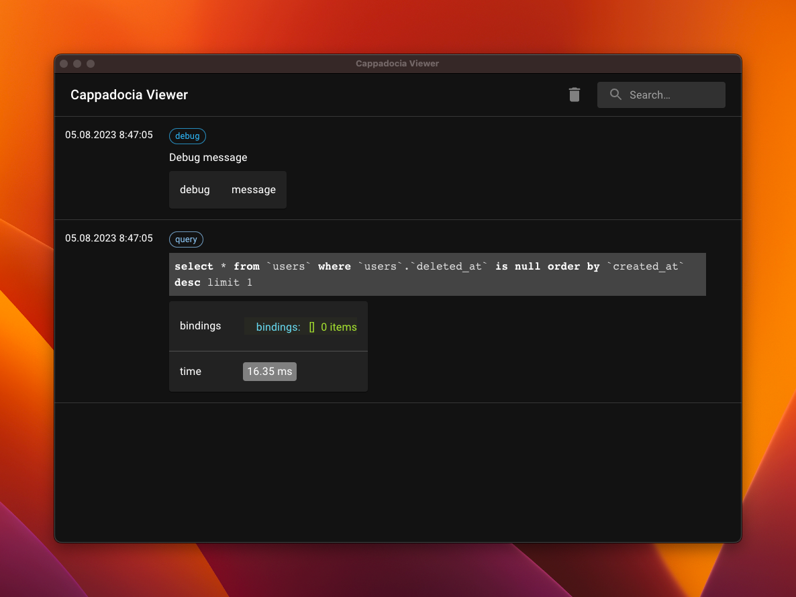

### Cappadocia Viewer

<picture>
  
</picture>

Cappadocia Viewer, a desktop application, significantly enhances the debugging experience by providing a dedicated window for seamless transmission of debugging information

### Installation

On the [Releases](https://github.com/hsndmr/cappadocia-viewer/releases/tag/0.0.2) page, you can find the latest version of:

- macOS
